# Travel Journal Platform

A cross-platform (Web & Mobile) interactive travel journal application that enables users to capturing trip stops, schedules, activities, ratings, and total distance traveled.

You can view the project at this link

https://travel-journal-one-orpin.vercel.app/

## 📌 Table of Contents

* [1. System & Architecture Overview](#1-system--architecture-overview)
* [2. Relational Database Schema](#2-relational-database-schema)
* [3. Data Engineering & ETL Pipeline](#3-data-engineering--etl-pipeline)
* [4. Gold Layer Analytics & Data Modeling Results](#4-gold-layer-analytics--data-modeling-results)
* [🛠️ 5. ETL Pipeline: Step-by-Step Implementation](#️-5-etl-pipeline-step-by-step-implementation)
  * [Step 1: Azure Infrastructure Provisioning](#step-1-azure-infrastructure-provisioning)
  * [Step 2: Databricks Secret Scope Setup](#step-2-databricks-secret-scope-setup)
  * [Step 3: Azure Data Factory (ADF) Configuration](#step-3-azure-data-factory-adf-configuration)
  * [Step 4: Databricks Incremental Bronze Ingestion Script](#step-4-databricks-incremental-bronze-ingestion-script)
  * [Step 5: Partitioning Strategy & Incremental Engine](#step-5-partitioning-strategy--incremental-engine)
  * [Step 6: ADF Trigger & Scheduling](#step-6-adf-trigger--scheduling)
  * [Step 7: Silver Layer Processing (Data Cleaning, Quality & Standardization)](#step-7-silver-layer-processing-data-cleaning-quality--standardization)
  * [Step 8: Gold Layer — Dimensional Modeling (Star Schema & DLT Pipelines)](#step-8-gold-layer--dimensional-modeling-star-schema--dlt-pipelines)
  * [Step 9: GitHub Actions CI/CD Automation & Databricks Asset Bundles](#step-9-github-actions-cicd-automation--databricks-asset-bundles)
  * [Step 10: Operational Architecture (Monitoring, Alerting, Logging & Error Handling)](#step-10-operational-architecture-monitoring-alerting-logging--error-handling)
---

## 1. System & Architecture Overview

- **Database Layer:** Managed PostgreSQL hosted on **Supabase**.
- **Storage Layer:** Supabase S3 buckets for media and image storage.
- **Data Pipelines & ETL:**
    - **Batch Orchestration:** Databricks Jobs (Scheduled triggers)
    - **Pipeline Processing:** Delta Live Tables (DLT) & PySpark
    - **Pipeline Testing:** Automated test runs via Databricks Jobs and DLT pipeline updates to validate incremental loading logic prior to production release.
- **CI/CD & Automation:** GitHub Actions for automated deployment and testing workflows.

## 2. Relational Database Schema

The core application data structure tracks user accounts, media mappings, and user preferences:

Source Code:

https://github.com/SiwaleKamasatjakul/travel-journal-etl/blob/main/schema/travel_journal.sql

## 3. Data Engineering & ETL Pipeline

### Source & Ingestion Strategy

- **Data Origin:** Ingested from the Supabase application backend via secure REST APIs.
- **Movement Pattern:** Batch ingestion scheduled and executed on **Databricks**.

Source Code:

https://github.com/SiwaleKamasatjakul/travel-journal-etl/blob/main/source_ingestion/Source%20Ingestion.ipynb

### Data Modeling & Storage

- **Analytical Architecture:** Raw operational transactional data is extracted and transformed into a **Star Schema** (Fact and Dimension tables) optimized for analytical reporting and journey analytics (e.g., aggregations on user activity, distance, ratings, and temporal trends).
- **Target Storage:** Transformed models are organized and stored in **Databricks Unity Catalog**, using three-level namespace governance (`catalog.schema.table`) to separate raw, silver, and analytical star schema layers.

### Data Quality & Production Readiness

- **Quality Assurance:** Automated validation suites, schema checks executed within the Databricks notebook/job environment prior to writing to target tables.
- **CI/CD & Operations:** Fully automated build and deployment workflows powered by **GitHub Actions** for continuous integration, code checks, and automated pipeline updates.


## 4. Gold Layer Analytics & Data Modeling Results

**Data Range:** June 1, 2026 – August 15, 2026

**Catalog:** `travel_journal_catalog.gold`

**Description:** This section documents the SQL queries and analytical models developed following the completion of the Gold layer data modeling phase.

## 1. Top 10 Most-Liked Posts

### Overview

Identifies the top 10 most popular trip posts based on overall engagement (likes).

### Tables Used

- `gold.fact_trip_post` (Post Fact)
- `gold.fact_post_like` (Like Fact)

### SQL Implementation

SQL

```
-- Top 10 most-liked posts
SELECT
    trip_post.trip_post_id,
    trip_post.trip_name,
    SUM(like.like_count) AS total_likes
FROM travel_journal_catalog.gold.fact_trip_post trip_post
INNER JOIN travel_journal_catalog.gold.fact_post_like like
    ON trip_post.trip_post_id = like.trip_post_id
GROUP BY
    trip_post.trip_post_id,
    trip_post.trip_name
ORDER BY
    total_likes DESC
LIMIT 10;
```
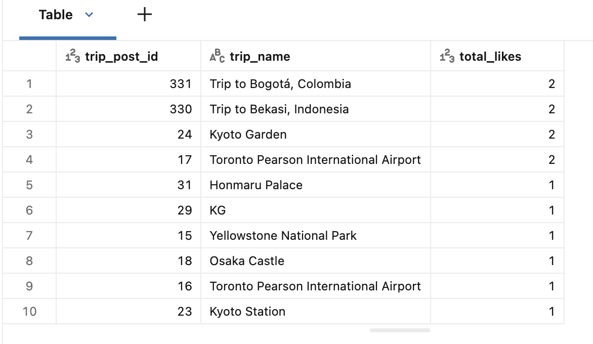

## 2. Top Activities Analysis

### Overview

Ranks the top activities engaged in by users across all posted trips.

### Tables Used

- `gold.bridge_trip_post_activity` (Trip-Activity Bridge)
- `gold.dim_activity_code` (Activity Dimension)

### SQL Implementation

SQL

```
-- Top activities breakdown
SELECT
    trip_post_act.activity_code,
    activity_code.activity_name,
    COUNT(*) AS activity_count
FROM travel_journal_catalog.gold.bridge_trip_post_activity trip_post_act
INNER JOIN travel_journal_catalog.gold.dim_activity_code activity_code
    ON trip_post_act.activity_code = activity_code.activity_code
GROUP BY
    trip_post_act.activity_code,
    activity_code.activity_name
ORDER BY
    activity_count DESC
LIMIT 10;
```
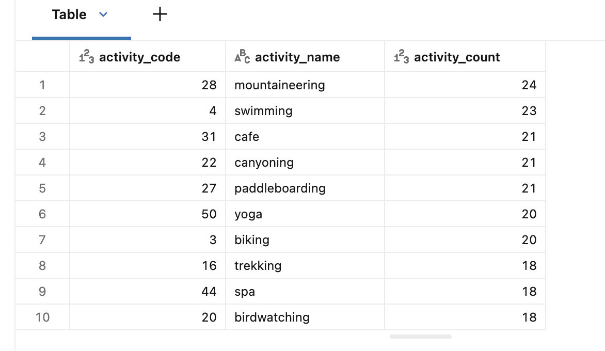

## 3. Posting Activity & Country Volume by Month

### Overview

Tracks monthly trends in posting activity broken down by destination country.

### Tables Used

- `gold.fact_trip_post` (Post Fact)
- `gold.dim_date` (Date Dimension)
- `gold.bridge_trip_post_country` (Trip-Country Bridge)
- `gold.dim_country_code` (Country Dimension)

### SQL Implementation

SQL

```
%sql
WITH monthly_counts AS (
    SELECT
        dim_date.month,
        country_code.country_name,
        COUNT(*) AS country_count
    FROM travel_journal_catalog.gold.fact_trip_post trip_post
    INNER JOIN travel_journal_catalog.gold.dim_date dim_date
        ON trip_post.post_date_id = dim_date.date_id
    INNER JOIN travel_journal_catalog.gold.bridge_trip_post_country country
        ON trip_post.trip_post_id = country.trip_post_id
    INNER JOIN travel_journal_catalog.gold.dim_country_code country_code
        ON country.country_code = country_code.country_code
    GROUP BY
        dim_date.month,
        country_code.country_name
),
ranked AS (
    SELECT
        month,
        country_name,
        country_count,
        ROW_NUMBER() OVER (
            PARTITION BY month
            ORDER BY country_count DESC, country_name ASC
        ) AS rn
    FROM monthly_counts
)
SELECT month, country_name, country_count
FROM ranked
WHERE rn <= 3
ORDER BY month ASC, country_count DESC, country_name ASC;
```
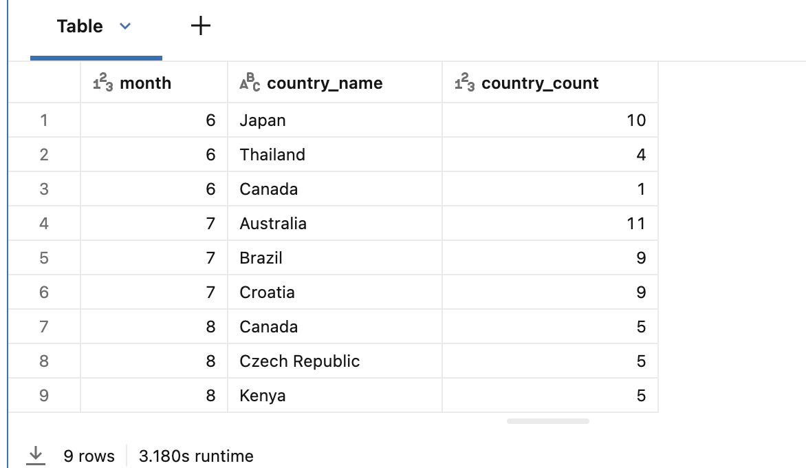

## 4. Average Trip Rating Grouped by Country and Activity

### Overview

Calculates average user ratings across specific travel activities within each destination country.

### Tables Used

- `gold.fact_trip_post` (Post Fact)
- `gold.bridge_trip_post_country` (Trip-Country Bridge)
- `gold.dim_country_code` (Country Dimension)
- `gold.bridge_trip_post_activity` (Trip-Activity Bridge)
- `gold.dim_activity_code` (Activity Dimension)

### SQL Implementation

```
-- Average trip ratings by country and activity
SELECT
    country_code.country_name,
    activity_code.activity_name,
    AVG(trip_post.rating) AS avg_rating,
    COUNT(DISTINCT trip_post.trip_post_id) AS total_trips
FROM travel_journal_catalog.gold.fact_trip_post trip_post
INNER JOIN travel_journal_catalog.gold.bridge_trip_post_country trip_country
    ON trip_post.trip_post_id = trip_country.trip_post_id
INNER JOIN travel_journal_catalog.gold.dim_country_code country_code
    ON trip_country.country_code = country_code.country_code
INNER JOIN travel_journal_catalog.gold.bridge_trip_post_activity trip_act
    ON trip_post.trip_post_id = trip_act.trip_post_id
INNER JOIN travel_journal_catalog.gold.dim_activity_code activity_code
    ON trip_act.activity_code = activity_code.activity_code
GROUP BY
    country_code.country_name,
    activity_code.activity_name
ORDER BY
    avg_rating DESC;
```

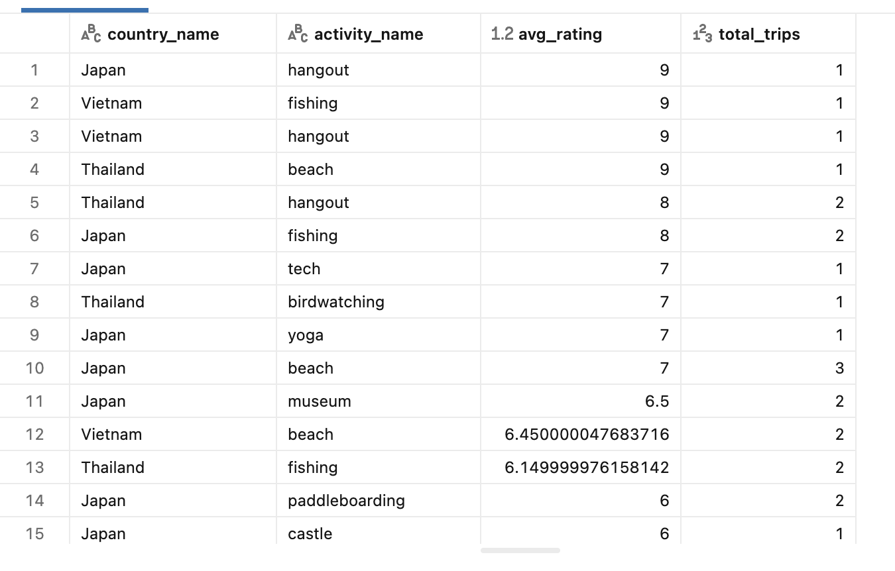

## 🛠️ 5. ETL Pipeline: Step-by-Step Implementation

### Architecture Overview

```text
[ Supabase PostgreSQL ]
       │
       │ (REST API / JDBC Extraction)
       ▼
[ Azure Data Factory ] ◄────── Sync Secrets ──────► [ Azure Key Vault ]
       │
       │ (Triggers PySpark Processing)
       ▼
[ Databricks Jobs (Auto Loader) ]
       │
       │ (Ingests & Governs via Unity Catalog)
       ▼
[ ADLS Gen2 Storage ]
   ├── /bronze/{table}  ──► Incremental raw ingestion + Checkpoint state
   ├── /silver/{table}  ──► Cleaned, dynamic CDC data & quality rules
   └── /gold/{table}    ──► Analytical Star Schema (Facts, Dims, Bridges)
```

## Step 1: Azure Infrastructure Provisioning

### 1. Resource Group & Storage

1. Create an **Azure Resource Group** 
2. Create an **Azure Data Lake Storage Gen2** account (Hierarchical Namespace enabled).
3. Create container named `lakehouse`.
4. Create the target landing directory structure inside the container:
    - `/travelsource/`
    - `/bronze/`
    - `/silver/`
    - `/gold/`
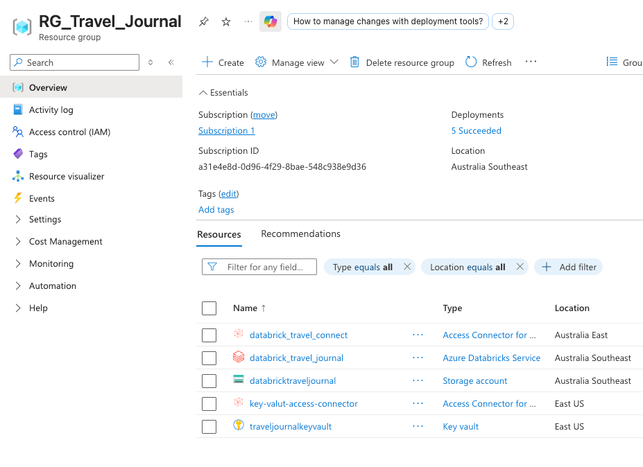
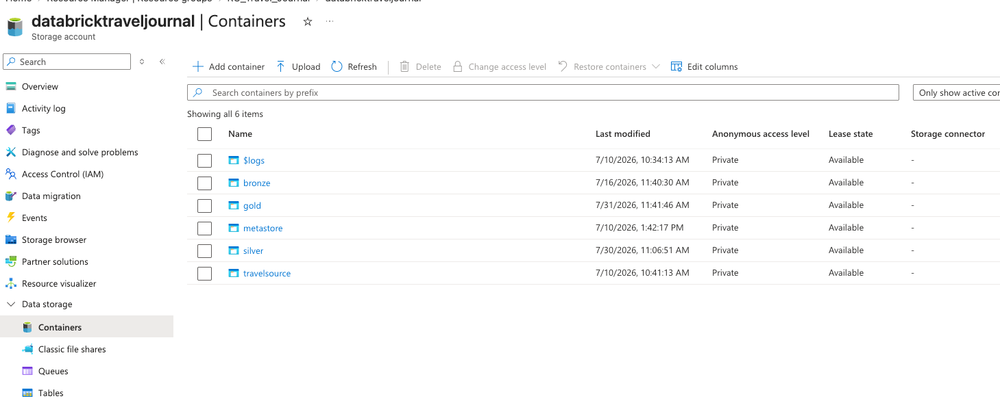

### 2. Azure Key Vault Configuration

1. Create an **Azure Key Vault** (e.g., `kv-travel-journal`).
2. Navigate to **Secrets** and add your Supabase credentials:
    - `supabase-url`: Your Supabase API REST URL or JDBC Connection String.
    - `supabase-key`: Service role key / API secret.
    - `storage-account-key`: ADLS Gen2 access key.

### 3. Grant Databricks & ADF Access to Key Vault

- In Key Vault **Access Policies** (or Azure RBAC), grant **Key Vault Secrets User** role to both:
    - Azure Data Factory Managed Identity.
    - Azure Databricks Managed Identity / Service Principal.

## Step 2: Databricks Secret Scope Setup

To securely reference Key Vault credentials directly in PySpark without hardcoding, link Key Vault to Databricks using an **Azure Key Vault-backed Secret Scope**:

1. Open Databricks workspace and go to: `https://<databricks-instance>#secrets/createScope`.
2. Set **Scope Name**: `supabase-scope`.
3. Provide the **DNS Name** and **Resource ID** from your Azure Key Vault properties page.

You can now call secrets in PySpark:
```
supabase_url = dbutils.secrets.get(scope="supabase-scope", key="supabase-url")
supabase_key = dbutils.secrets.get(scope="supabase-scope", key="supabase-key")
```
## Step 3: Azure Data Factory (ADF) Configuration

### 1. Create Linked Services

- **Supabase Linked Service:** HTTP REST API endpoint or PostgreSQL JDBC connection using Azure Key Vault secrets.
- **Databricks Linked Service:** Point to your Azure Databricks workspace authentication via Personal Access Token (PAT) or Azure AD Managed Identity.
- **Azure Key Vault Linked Service:** Point to your Key Vault.

### 2. ADF Orchestration Pipeline

Create a pipeline using a **ForEach Activity** to iterate over your target tables dynamically.

#### Pipeline Parameters

- `table_list` (Array):

## Step 4: Databricks Incremental Bronze Ingestion Script

This PySpark script uses **Databricks Auto Loader (`cloudFiles`)** for incremental processing, schema inference, progress checkpointing, and date-based partitioning.

Source Code:

https://github.com/SiwaleKamasatjakul/travel-journal-etl/tree/main/bronze_incremental

## Step 5: Partitioning Strategy & Incremental Engine

### Why Data Partitioning?

For travel post metrics (`trip_posts`, `trip_stops`), volume grows continuously over time. Partitioning by date (`year`/`month`/`day` or `created_at_date`) provides three major benefits:

1. **Query Pruning:** Queries targeting specific date ranges skip scanning unrelated files, significantly reducing latency and compute costs.
2. **File Organization:** Prevents single large directories by balancing output into structured partition directories.
3. **Seamless Scaling:** Handles high write rates as daily travel activity scales up.
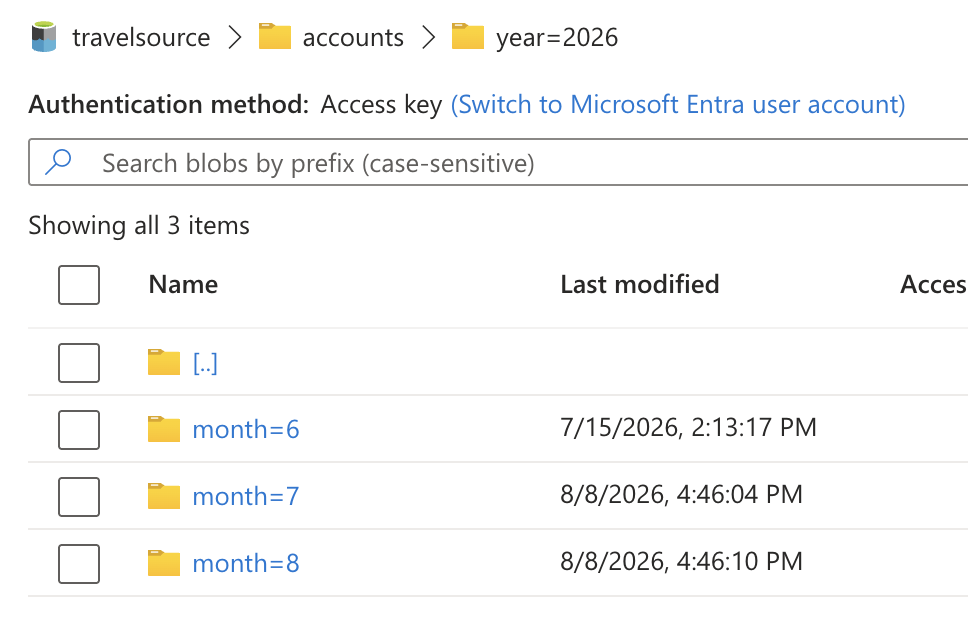

### Incremental Execution Flow (`availableNow=True`)

- **Schema Tracking (`schemaLocation`):** Auto Loader records column structure. If Supabase alters schema in future releases, updates are caught automatically without pipeline failures.
- **Offset Tracking (`checkpointLocation`):** Tracks processed files. Subsequent runs skip already ingested records to prevent duplicate processing.
- **Batch Micro-burst (`availableNow=True`):** Processes all pending micro-batches as a single batch, updating the checkpoint before gracefully shutting down cluster resources.

## Step 6: ADF Trigger & Scheduling

1. In Azure Data Factory, add a **Schedule Trigger** to the pipeline .
2. Set execution frequency to **Daily at 00:00 UTC** (or hourly depending on travel update SLAs).
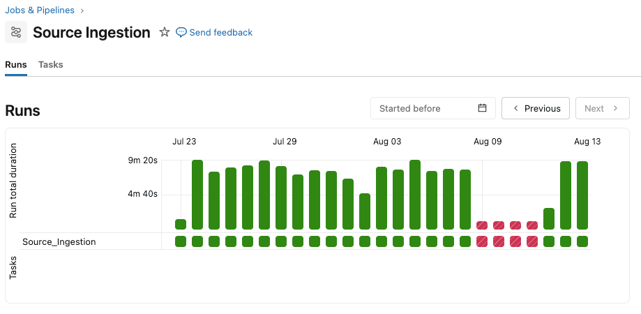

## Step 7: Silver Layer Processing (Data Cleaning, Quality & Standardization)

The Silver layer transforms raw, append-only Bronze data into clean, deduplicated Delta tables. Each table in the pipeline receives a dedicated PySpark processing notebook to handle table-specific schema validations and cleaning rules.

Source Code:

<https://github.com/SiwaleKamasatjakul/travel-journal-etl/tree/main/silver_layer>

### Silver Layer Architecture & Storage

- **Storage Target:** ADLS Gen2 Delta format (`abfss://silver@databricktraveljournal.dfs.core.windows.net/<table_name>`)
- **Governance:** Registered under **Databricks Unity Catalog** (`workspace.silver.<table_name>`)
- **Execution Environment:** Databricks compute clusters.
```
[ Bronze Layer (Parquet/Delta) ]
               │
               ▼
┌────────────────────────────────────────────────────────┐
│               SILVER NOTEBOOK PIPELINE                 │
├────────────────────────────────────────────────────────┤
│ 1. Schema Enforcement & Data Quality Checks            │
│    • Extract missing created_at from _rescued_data     │
│    • Trim string whitespace                            │
│    • Correct seeded year errors (2024 ➔ 2026)          │
│    • Enforce Primary Key Non-Null rules               │
├────────────────────────────────────────────────────────┤
│ 2. Deduplication via Window Functions (QUALIFY Pattern)│
│    • Partition by Primary Key, Order by latest date    │
├────────────────────────────────────────────────────────┤
│ 3. Unity Catalog Delta Target Write                   │
│    • Write mode: Overwrite / Merge into Unity Catalog  │
└────────────────────────────────────────────────────────┘
               │
               ▼
[ Silver Layer (Unity Catalog Managed Delta Tables) ]
```
## Processing Steps Explained

### 1. Data Quality & Cleaning

- **Rescued Data Extraction:** When Auto Loader encounters unparseable or corrupted payload columns in Bronze, it pushes them into `_rescued_data`. We inspect `_rescued_data` to rescue missing `created_at` timestamps using `get_json_object`.
- **Text Normalization:** Strip leading and trailing whitespace across text fields (`trim()`).
- **Seeded Year Correction:** Auto-generated mock/seeded data incorrectly generated timestamps set in `2024`. We programmatically adjust these date values forward to `2026` using PySpark date manipulation functions.
- **Non-Null Enforcement:** Reject/filter out invalid records missing core identifier keys (e.g., `id`, `user_id`, `post_id`).


## Step 8: Gold Layer — Dimensional Modeling (Star Schema & DLT Pipelines)

In this phase, clean Silver tables are transformed into Gold layer **Fact and Dimension tables** using **Delta Live Tables (DLT)**.

Source Code:

https://github.com/SiwaleKamasatjakul/travel-journal-etl/tree/main/gold_layer

### 1. SCD Type 1 Dimensions (Activity Code & Country Code)

SCD Type 1 updates record values directly in place, keeping only the current state without historical tracking. We use DLT's `dlt.apply_changes` with data quality expectations enforced using `@dlt.expect_all_or_drop`.

Source Code:

https://github.com/SiwaleKamasatjakul/travel-journal-etl/blob/main/gold_layer/Gold%20Activity%20Code.ipynb


```python
 # Quality Expectations Rule Definitions
activity_rules = {
    "valid_id": "id IS NOT NULL",
    "valid_activity_code": "activity_code IS NOT NULL",
    "valid_sequence": "created_at IS NOT NULL"
}
```

```jsx
country_rules = {
    "valid_id": "id IS NOT NULL",
    "valid_country_code": "country_code IS NOT NULL",
    "valid_sequence": "created_at IS NOT NULL"
}
```
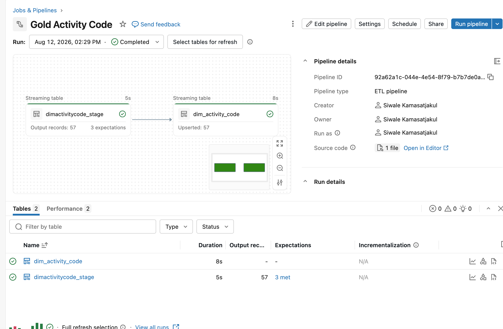

### 2. Date Dimension (`dim_date`)

The Date Dimension provides a rich calendar table for travel analytics, allowing time-series aggregations (year, quarter, month, day of week, weekend flags).

Source Code:

https://github.com/SiwaleKamasatjakul/travel-journal-etl/blob/main/gold_layer/Gold%20Dim%20Date.ipynb

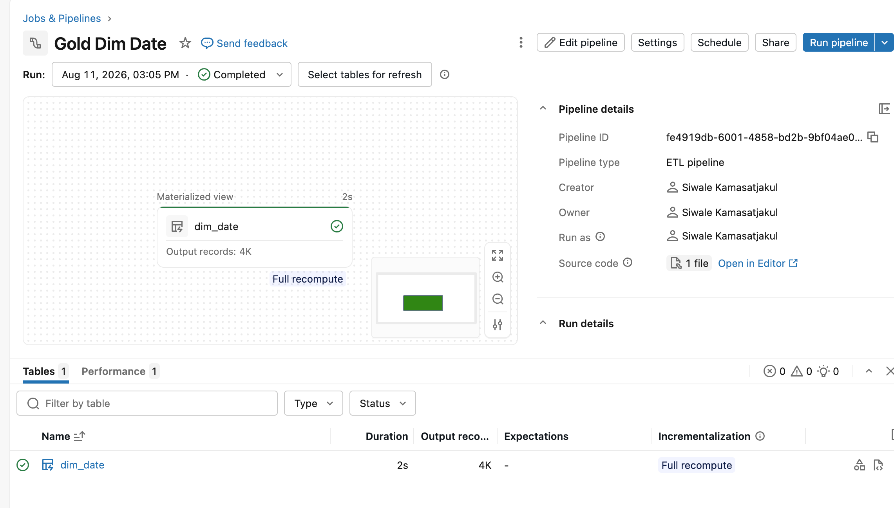

### 3.Dimension Modeling: User Dimension (`dim_user`)

The User Dimension captures profile attributes across user accounts. To protect sensitive credentials, private attributes like `passwordhash` and `email` are dropped during transformation. Historical updates (e.g., changes to `username`, `bio_text`, or `role`) are tracked using **Slowly Changing Dimension Type 2 (SCD Type 2)**.

Source Code:

https://github.com/SiwaleKamasatjakul/travel-journal-etl/blob/main/gold_layer/Gold%20Layer%20Dim%20User.ipynb

**Processing Architecture**

```jsx
[ silver.accounts ] ──(Streaming)──┐
[ silver.bio ]      ──(Batch Read)─┼──> [ DimUser_stage_view ] ──(SCD Type 2)──> [ dim_user ]
[ silver.images ]   ──(Batch Read)─┘
```

1. **Validation Staging (`DimUser_stage`):** Enforces data quality contracts (`user_id` and `created_at` non-null constraints) using `@dlt.expect_all_or_drop`.
2. **Profile Enrichment (`DimUser_stage_view`):** Joins account streaming data with `bio` and `images` tables, strips credentials, and generates a deterministic surrogate key (`DimUserKey`).
3. **SCD Type 2 Target (`dim_user`):** Applies `dlt.apply_changes` with `stored_as_scd_type="2"` to automatically maintain valid date windows (`__start_at`, `__end_at`) and flag the active record (`__is_current`).

#### Technical Highlights

- **Data Governance & Privacy:** Excludes non-essential and sensitive security details (`passwordhash`, `email`, `preferences`) prior to persistent analytical storage.
- **Surrogate Key Consistency:** Generates `DimUserKey` via `SHA-256` hashing over `user_id` and timestamp combinations to establish deterministic identifiers.
- **Automated Change Data Capture:** Leverages Delta Live Tables `apply_changes` to handle dimensional tracking without requiring custom SQL merge and status update logic.


### 4. Fact Tables: Engagement & Social Graph (`fact_post_like`, `fact_post_bookmark`)

The Gold engagement and social layer converts interaction streams (likes, bookmarks) into high-performance fact tables. These tables resolve user foreign keys against the **SCD Type 2 `dim_user` dimension** using **effective date range matching (`__START_AT` and `__END_AT`)** to guarantee point-in-time state accuracy.

Source Code:

https://github.com/SiwaleKamasatjakul/travel-journal-etl/blob/main/gold_layer/Gold%20Fact%20Post%20Likes%20and%20Bookmark.ipynb


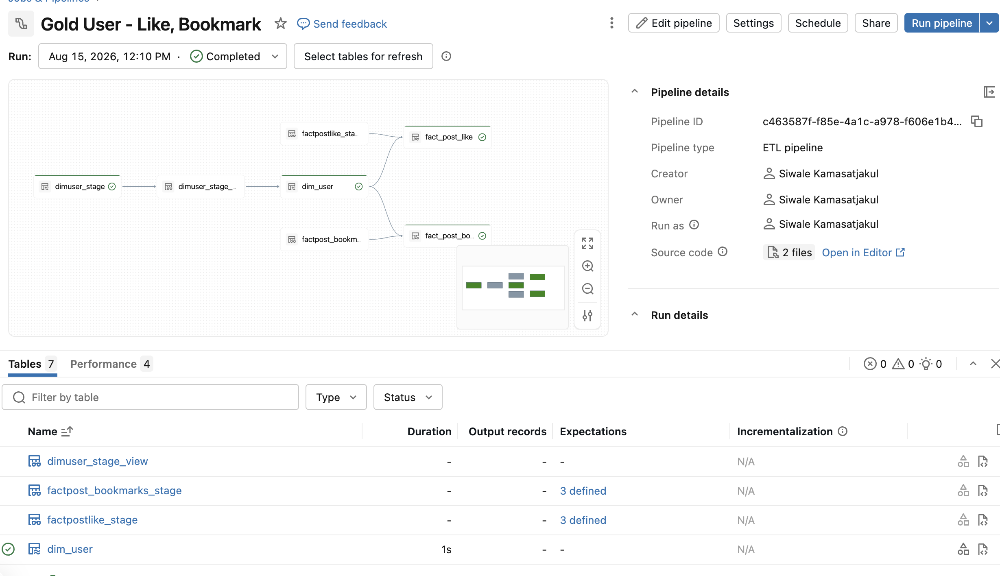

#### Design & Data Quality Rules

- **Type:** Transactional Fact (Point-in-time engagement events).
- **Data Quality Contracts (`@dlt.expect_all_or_drop`):**
- **Additive Metrics:** Adds a synthetic constant column `F.lit(1).alias("like_count")` (or `bookmark_count`) to enable instant `SUM()` aggregations without runtime `COUNT(*)` overhead.

### **5. Fact Follows (`fact_follows`)**

The `fact_follows` table captures directed relationships between users (`follower_id` → `following_id`).

Source Code:

https://github.com/SiwaleKamasatjakul/travel-journal-etl/blob/main/gold_layer/Gold%20Follow.ipynb

```jsx
				  ┌─────────────────────────────────────────────────────────┐
                  │                 fact_follows (Event)                    │
                  │  follower_id = User A  │  following_id = User B         │
                  └────────────┬────────────────────────┬───────────────────┘
                               │                        │
       Join 1 (Follower Role)  │                        │  Join 2 (Following Role)
                               ▼                        ▼
     ┌───────────────────────────────────┐    ┌───────────────────────────────────┐
     │      dim_user (Alias: follower)   │    │     dim_user (Alias: following)   │
     │  user_id: A                       │    │  user_id: B                       │
     │  DimUserKey: hash_A_v2            │    │  DimUserKey: hash_B_v1            │
     └───────────────────────────────────┘    └───────────────────────────────────┘
```
> **Dual-Role SCD Type 2 User Resolution**
> 
> 
> Map `dim_user` twice per fact record to resolve independent historical profile snapshots (`follower_key` and `following_key`) at `created_at`, enabling decoupled point-in-time analytics for both actor and target.
>
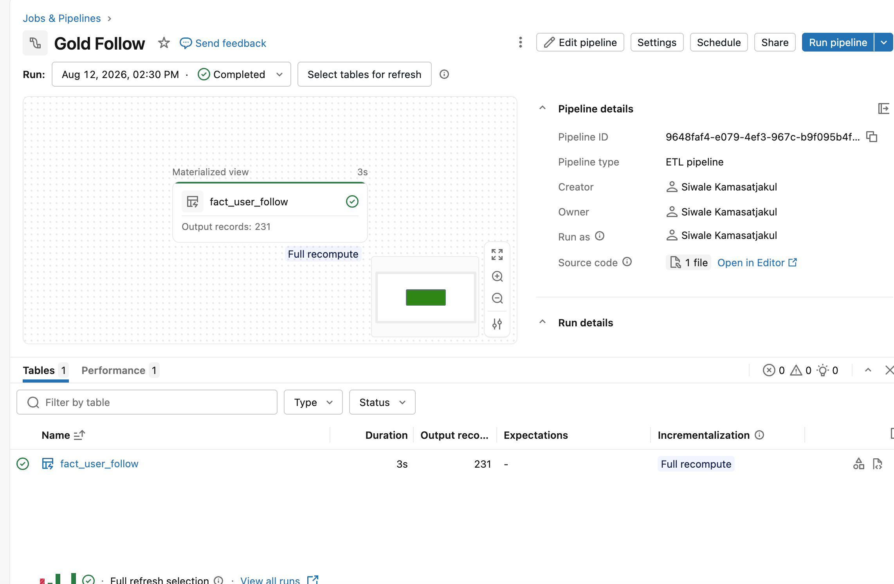

## 6. Google Map Address Dimension (`DimGoogleAddress`)

This pipeline transforms raw location data into a Gold-layer Slowly Changing Dimension Type 1 (**SCD Type 1**) table (`travel_journal_catalog.gold.DimGoogleAddress`). It uses **Delta Lake MERGE (Upsert)** semantics to apply in-place updates for existing address records and append new address entities while maintaining sequential surrogate key assignment.

Source Code:

https://github.com/SiwaleKamasatjakul/travel-journal-etl/blob/main/gold_layer/Gold%20Google%20Map%20Address.ipynb

**Architecture & Upsert Strategy**

```jsx
						  ┌───────────────────────────┐
                          │ Incoming Address Data Stream│
                          └─────────────┬─────────────┘
                                        │
                                        ▼
                          ┌───────────────────────────┐
                          │  Max Surrogate Key Lookup │
                          │   (spark.sql MAX Key)     │
                          └─────────────┬─────────────┘
                                        │
                                        ▼
                          ┌───────────────────────────┐
                          │ Dynamic Key Shift & Offset│
                          │ (monotonically_increasing)│
                          └─────────────┬─────────────┘
                                        │
                                        ▼
                       /─────────────────────────────────\
                      < Does Target Gold Delta Table Exist? >
                       \─────────────────────────────────/
                                 /               \
                          [YES] /                 \ [NO]
                               /                   \
                              ▼                     ▼
               ┌─────────────────────────────┐   ┌─────────────────────────────┐
               │   Delta MERGE (Upsert)      │   │  Initial Table Load         │
               │ • whenMatchedUpdateAll()     │   │ • Overwrite Mode            │
               │ • whenNotMatchedInsertAll() │   │ • Save as Delta Table       │
               └─────────────────────────────┘   └─────────────────────────────┘
```

### 1. Create Surrogate Key

To guarantee unique, incrementing surrogate keys (`DimGoogleAddressKey`) across dynamic pipeline executions, the script evaluates whether the execution is an initial bootstrap run or an incremental batch run:

- **Initial Load (`init_load_flag == 1`):** Assigns a base offset of `0`.
- **Incremental Load:** Queries the target Delta table using Spark SQL to fetch the current maximum surrogate key (`MAX(DimGoogleAddressKey)`):

Incoming records are generated using `monotonically_increasing_id() + 1` combined with the fetched `max_surrogate_key` offset, ensuring no primary key collisions occur between batches.
****

### 2. Idempotent Target Persistence (SCD Type 1 MERGE)

The implementation verifies target table existence via `spark.catalog.tableExists()` to decide between **Table Initialization** and **Delta MERGE (Upsert)** operations:

#### A. Initial Bootstrap (Table Creation)

If the Gold table does not exist, the DataFrame is saved as a managed Delta Lake table registered under Unity Catalog:

#### B. Incremental Upsert (SCD Type 1 MERGE)

When the target table exists, `DeltaTable.forPath()` opens the storage location and executes a Delta MERGE operation:

```jsx
dlt_obj = DeltaTable.forPath(spark, "abfss://gold@databricktraveljournal.dfs.core.windows.net/DimGoogleAddress")

dlt_obj.alias("trg").merge(
    df_final.alias("src"), 
    "trg.DimGoogleAddressKey = src.DimGoogleAddressKey"
) \
.whenMatchedUpdateAll() \
.whenNotMatchedInsertAll() \
.execute()
```

- **`whenMatchedUpdateAll()`:** Updates changed attributes (e.g., corrected street names, updated postal codes) in place without duplicating records, preserving SCD Type 1 behavior.
- **`whenNotMatchedInsertAll()`:** Appends newly discovered address entities into the Gold dimension table.

- **SCD Type 1 Consistency:** Keeps dimension data compact by overwriting outdated attributes in place.
- **ACID Transactions:** Delta MERGE ensures atomic operations—preventing partial writes or data corruption during failures.
- **Unity Catalog Native:** Integrates storage directly with Unity Catalog namespaces (`travel_journal_catalog.gold`), enabling data governance and downstream BI visibility.

## 7. Fact Trip Posts & Bridge Tables for Multi-Valued Attributes

**Main Fact Table (`fact_trip_post`):** Holds core post metrics (1 row per trip post—e.g., total distance, overall rating).
**Bridge Tables:** Link 1 post to multiple tags without causing duplicate rows in the main fact table:
    ◦ `bridge_trip_post_country`: Maps 1 post → Multiple Countries
    ◦ `bridge_trip_post_activity`: Maps 1 post → Multiple Activities

Source Code:

https://github.com/SiwaleKamasatjakul/travel-journal-etl/blob/main/gold_layer/Gold%20Trip%20Post.ipynb


**1. Architectural & Data Modeling Diagram**

```jsx
						  ┌───────────────────────────┐
                          │         dim_user          │
                          │   (User Profile Data)     │
                          └─────────────┬─────────────┘
                                        │
                                        │ (1 User has Many Posts)
                                        ▼
                          ┌───────────────────────────┐
                          │      fact_trip_post       │
                          │  (1 Row Per Trip Post)    │
                          │   • Distance, Rating      │
                          └──────┬─────────────┬──────┘
                                 │             │
        (1 Post has Many         │             │        (1 Post has Many 
         Country Tags)           │             │         Activity Tags)
                                 ▼             ▼
  ┌──────────────────────────────┐             ┌──────────────────────────────┐
  │   bridge_trip_post_country   │             │   bridge_trip_post_activity  │
  │   (Post ID <-> Country Code) │             │   (Post ID <-> Activity Code)│
  └──────────────┬───────────────┘             └──────────────┬───────────────┘
                 │                                            │
                 │ (Links to Country Names)                   │ (Links to Activity Names)
                 ▼                                            ▼
  ┌──────────────────────────────┐             ┌──────────────────────────────┐
  │      dim_country_code        │             │      dim_activity_code       │
  │     (France, Italy...)       │             │    (Hiking, Scuba Diving...) │
  └──────────────────────────────┘             └──────────────────────────────┘
```

## 2. Fact Trip Posts (`fact_trip_post`)

### Design Principles & Features

- **Fact Grain:** One row per published trip post.
- **Point-in-Time Key Resolution:** Joins the streaming posts against the SCD Type 2 `dim_user` table using timestamp ranges (`created_at BETWEEN __START_AT AND __END_AT`) to preserve historical user state (e.g., profile version at the time of posting).
- **Additive Metrics:** Captures continuous numerical attributes such as `total_distance` and `trip_rating`.

**3. Bridge Tables for Multi-Valued Tagging**
Bridge tables resolve $M:N$ relationships without creating Cartesian fan-out errors in fact aggregations. Deleted or soft-deleted tags are excluded by filtering `flag == False`.
**A. Country Location Bridge (`bridge_trip_post_country`)**
Connects `fact_trip_post` to `dim_country_code`. Allows a single trip post (e.g., "EuroTrip 2026") to map to multiple country codes (`FR`, `IT`, `DE`).
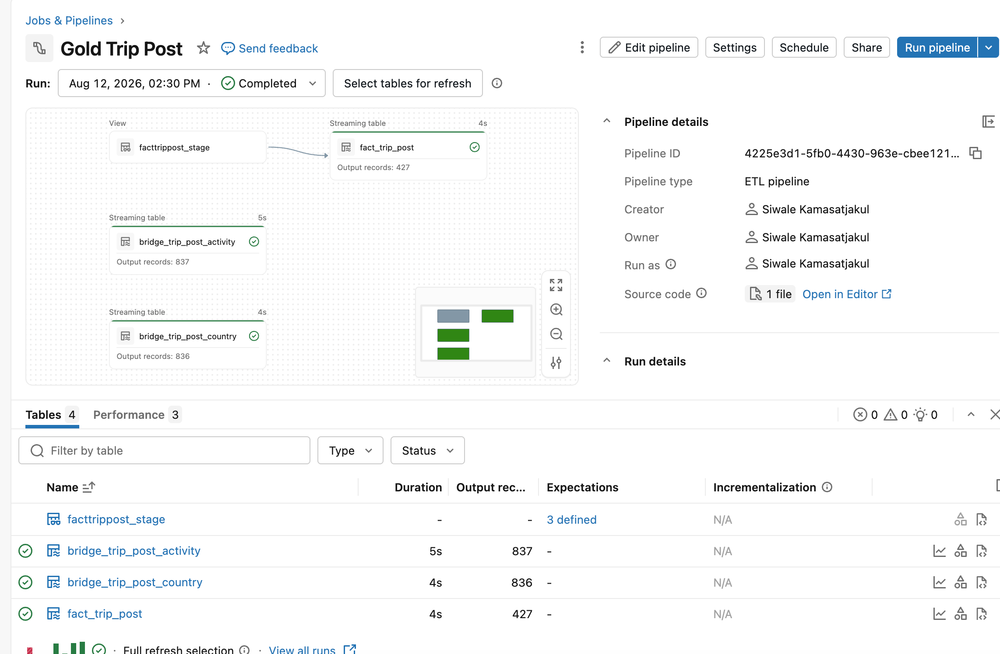

### B. Activity Tag Bridge (`bridge_trip_post_activity`)

Connects `fact_trip_post` to `dim_activity_code`. Allows a trip post to contain multiple tagged activities (`SNORKEL`, `CAMPING`, `FOOD_TOUR`).

## 8.Fact Trip Stops

The `fact_trip_stop` table records individual stops or itinerary waypoints made during a trip (e.g., visiting a landmark, eating at a restaurant, staying at a hotel).

It connects each stop back to its parent trip post, validates the user's account history via the **SCD Type 2 `dim_user` table**, and resolves location metadata against the **Google Maps Address Dimension (`dimgoogleaddress`)**.

Source Code:

https://github.com/SiwaleKamasatjakul/travel-journal-etl/blob/main/gold_layer/Gold%20Trip%20Stop.ipynb

**1. Architectural & Data Modeling Diagram**

```jsx
					   ┌──────────────────────────────┐
                       │           dim_user           │
                       │ (SCD2: Point-in-Time Lookup) │
                       └──────────────┬───────────────┘
                                      │
                                      │ (Inner Join: Validates User)
                                      ▼
┌──────────────────────────────┐    ┌──────────────────────────────┐
│        fact_trip_post        │    │        fact_trip_stop        │
│    (Parent Trip Metadata)    ├───►│  (1 Row Per Itinerary Stop)  │
└──────────────────────────────┘    │   • Duration, Rating, Count  │
                                    └──────────────┬───────────────┘
                                                   │
                                                   │ (Left Join: Preserves Unlinked Stops)
                                                   ▼
                       ┌──────────────────────────────┐
                       │      dimgoogleaddress        │
                       │  (Location & Map Details)    │
                       └──────────────────────────────┘
```

## Key Technical Features

1. **SCD Type 2 Point-in-Time Validation (`dim_user`):**
Uses an **inner join** against `dim_user` using timestamp boundaries (`time >= __START_AT` and `time <= __END_AT`). This ensures every stop is matched to the exact version of the user's profile active when the stop occurred.
2. **Left Join with Fallback Key (`dimgoogleaddress`):**
Uses a **left join** to resolve `DimGoogleAddressKey`. If a stop does not have a linked Google Maps address (`google_maps_address_id` is null or missing), the record is still preserved, and `F.coalesce()` assigns a default surrogate key of `1` (Unknown/Unlinked Location).
3. **Additive Metrics:**
Includes `duration_minutes`, `rating`, and a pre-calculated constant column `stop_count = 1` for fast SQL aggregations (e.g., `SUM(stop_count)`).

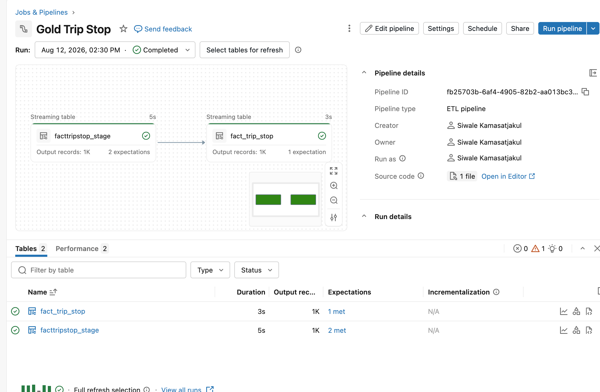

# Step 9: GitHub Actions CI/CD Automation & Databricks Asset Bundles

This step establishes an automated **CI/CD pipeline** to connect the GitHub repository directly to the Databricks Workspace. It enforces continuous integration by deploying distinct notebooks per data tier (**Source Ingestion**, **Bronze**, **Silver**, and **Gold**) and dynamically triggering jobs across environments using **Databricks Asset Bundles (DABs)** and **GitHub Actions**.

**🚀 1.CI/CD Architectural Workflow**

```jsx
[ 1. Git Repository ]
  └─ Push code to main branch
        │
        ▼
[ 2. GitHub Actions CI/CD Workflow ]
  ├─ 2.1 Checkout repository code (actions/checkout@v4)
  ├─ 2.2 Configure Python runtime (3.10+)
  ├─ 2.3 Install & authenticate Databricks CLI
  ├─ 2.4 Sync Workspace Git Folder (databricks repos update)
  └─ 2.5 Deploy Asset Bundles (databricks bundle deploy)
        │
        ▼
[ 3. Databricks Execution Pipeline ]
  ├─ Stage 1: Source Ingestion Job (Serverless)
  ├─ Stage 2: Bronze Incremental Job (Serverless)
  ├─ Stage 3: Silver Layer DLT Job (Serverless)
  └─ Stage 4: Gold Layer DLT Pipeline (Star Schema: Dimensions, Facts, Bridges)
```

### 2.Infrastructure as Code: `databricks.yml`

The `databricks.yml` asset bundle defines multi-task pipeline workflows and standardizes cluster configurations.

### 3. GitHub Actions Workflow: `.github/workflows/deploy.yml`

An automation workflow using current GitHub Action steps (migrated from deprecated commands like `set-output` to `$GITHUB_OUTPUT`).

### 4. Required GitHub Environment Secrets
Before triggering the deployment pipeline, configure these encrypted secrets in **GitHub Repository Settings → Secrets and variables →Actions**:

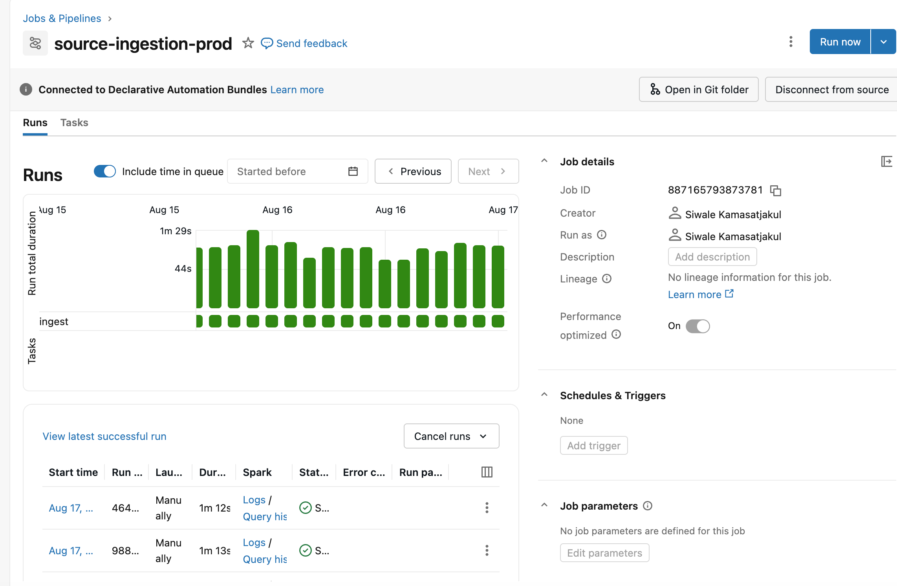

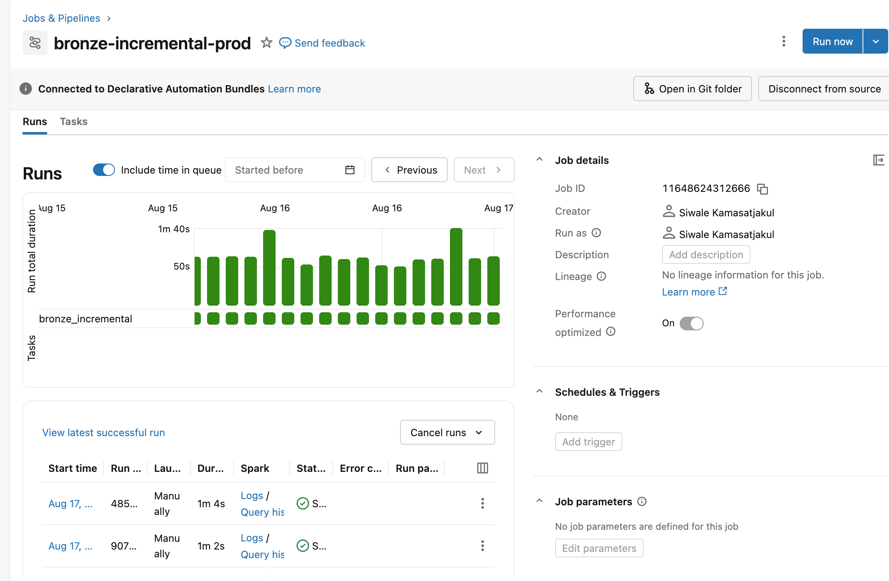

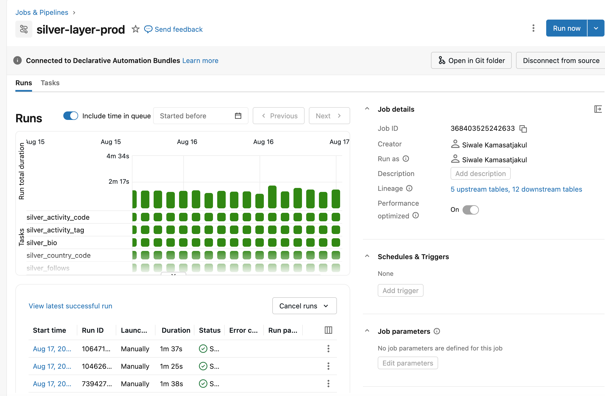

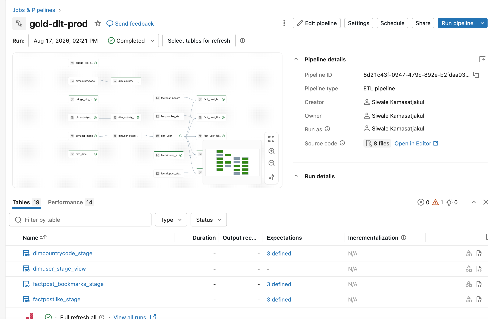


## Step 10: Operational Architecture (Monitoring, Alerting, Logging & Error Handling)

This section outlines the operational framework used to monitor data processing, track pipeline failures, handle errors, and inspect execution logs across Databricks and GitHub Actions.

```
[ GitHub Actions ] ──► Deploy & CI/CD Logs
                             │
[ Databricks UI ]  ──► Job Runs & Task Logs (Ingestion / Bronze / Silver)
                             │
[ DLT Event Logs ] ──► System Metrics & Quality Expectations ( Gold)
```

### 1. Job & Execution Monitoring (Databricks Workflows)

- **UI Testing & Workflow Validation:** The Databricks Workflows UI is utilized during testing and runs to monitor real-time execution status for scheduled jobs:
    - **Source Ingestion Job**
    - **Bronze Incremental Job**
- **Status Tracking:** Provides visual pipeline graph execution status (Succeeded, Failed, Running, Skipped) with task-level duration metrics.

**Silver Layer Operational Status**

- **Current Execution Method:** Interactive/Manual notebook execution.
- **Production Gap:** Manual triggers introduce operational risk, lack automated retry mechanisms, and limit real-time visibility into failures.
- **Target Improvement:** Migrate notebook logic into an automated **Databricks Workflow Job** or **DLT Pipeline** integrated with the existing GitHub Actions CI/CD workflow.

### 2. Delta Live Tables (DLT) Monitoring (Gold Layers)

- **Pipeline Pipeline UI:** Real-time visibility into streaming processing rates, records ingested, and pipeline cluster health across:
    - **Gold DLT Pipeline:** Star schema creation (Dimensions, Facts, and Bridge tables).

### 3. Centralized Logging & Error Handling

#### Databricks Execution Logs

- **Task & Driver Logs:** Detailed standard output (`stdout`), standard error (`stderr`), and driver logs are preserved within each individual Databricks Job run and DLT execution history.

#### CI/CD & Deployment Error Handling (GitHub Actions)

- **Build & Deploy Failures:** GitHub Actions validates CLI operations during deployment steps (`databricks repos update` and `databricks bundle deploy`).
- **Deployment Gates:** If authentication fails or asset bundle syntax checks fail, the workflow aborts immediately, keeping previous stable code deployed in production while capturing standard error logs directly in the GitHub Actions run summary.